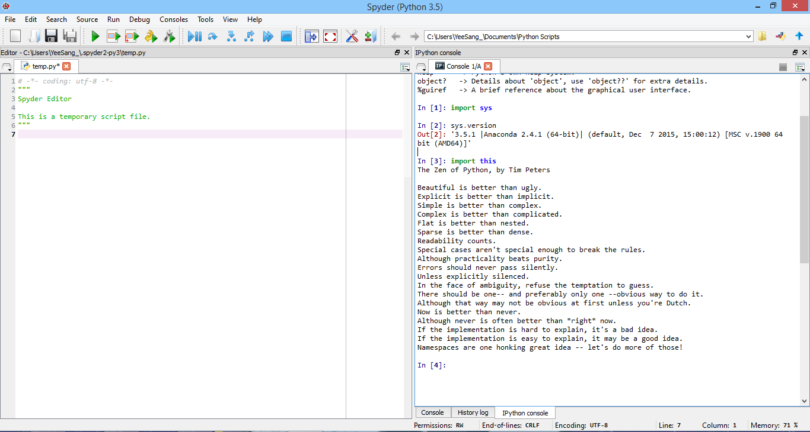

UECM3033 Assignment #1 Report
========================================================

- Prepared by: Foo Yee Sang
- Tutorial Group: T2

--------------------------------------------------------

## Task 1 -- setup a github repository

The reports, codes and supporting documents are uploaded to Github at: 

[https://github.com/YeeSang/UECM3033_assign1](https://github.com/YeeSang/UECM3033_assign1)

---------------------------------------------------------

## Task 2 -- setup python

------------------------------------------------------------

## Task 3 -- modify and run Python script

1. 
Hexadecimal representation of 1305785 is 0x13ecb9

2.
$$\int_0^{\infty} x^{2}*e^{-x^2} dx = \frac{\sqrt{\pi}}{4}.$$

3.
\begin{align*}
3 x_0 +1 x_1 +6 x_2 +3 x_3 +1 x_4 +2 x_5 +4 x_6 +6 x_7 +8 x_8 +9 x_9 &= 119,\\
1 x_0 +1 x_1 +2 x_2 +5 x_3 +7 x_4 +3 x_5 +8 x_6 +4 x_7 +2 x_8 +2 x_9 &= 38,\\
9 x_0 +7 x_1 +5 x_2 +3 x_3 +1 x_4 +2 x_5 +4 x_6 +5 x_7 +7 x_8 +8 x_9 &= 57,\\
2 x_0 +4 x_1 +3 x_2 +6 x_3 +8 x_4 +9 x_5 +6 x_6 +4 x_7 +8 x_8 &= 106,\\
1 x_0 +2 x_1 +3 x_2 +4 x_3 +5 x_4 +6 x_5 +7 x_6 +8 x_7 +9 x_8 &= 45,\\
7 x_0 +8 x_1 +9 x_2 +3 x_3 +1 x_4 +6 x_5 +3 x_6 +5 x_7 +8 x_8 +1 x_9 &= 124,\\
6 x_0 +7 x_1 +8 x_2 +2 x_3 +4 x_4 +5 x_5 +6 x_6 +7 x_7 +1 x_8 +2 x_9 &= 83,\\
8 x_0 +5 x_1 +3 x_2 +1 x_3 +3 x_4 +5 x_5 +6 x_6 +8 x_7 +9 x_8 +2 x_9 &= 102,\\
1 x_0 +2 x_1 +4 x_2 +2 x_3 +5 x_4 +3 x_5 +5 x_6 +8 x_7 +5 x_8 +2 x_9 &= 41,\\
7 x_0 +8 x_1 +9 x_2 +3 x_3 +2 x_4 +1 x_5 +5 x_6 +6 x_7 +8 x_8 +9 x_9 &= 79.
\end{align*}

-----------------------------------

last modified: 28/1/2016 11:30pm
